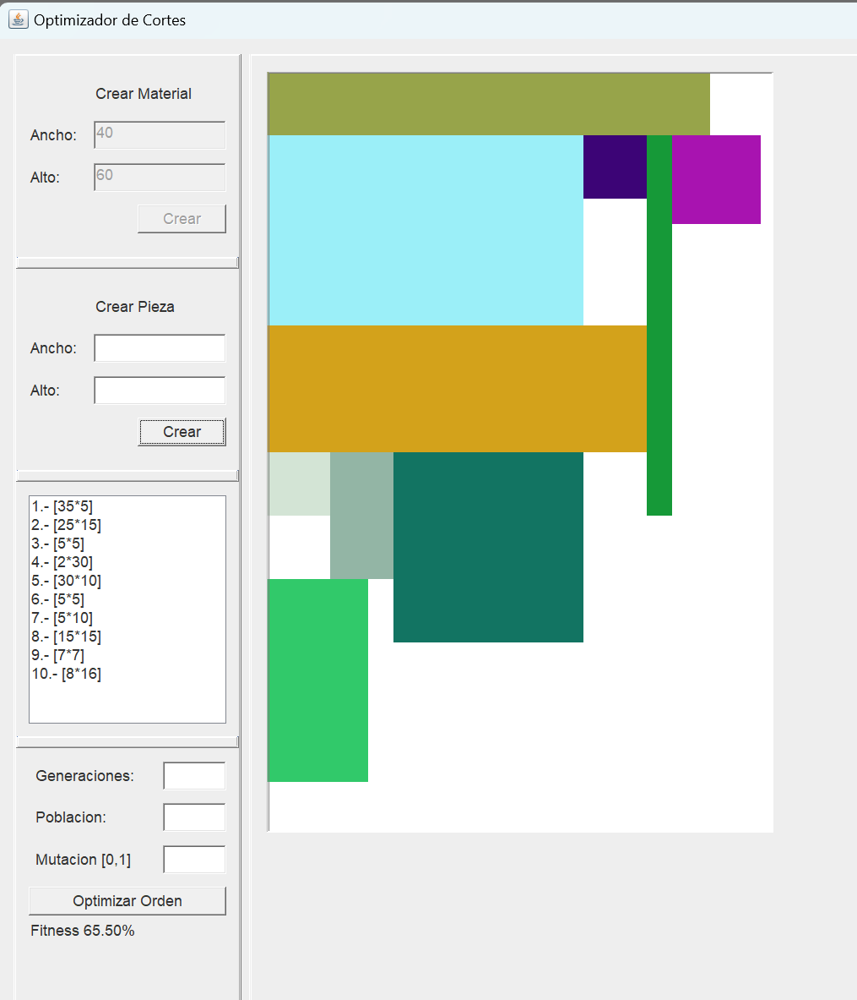
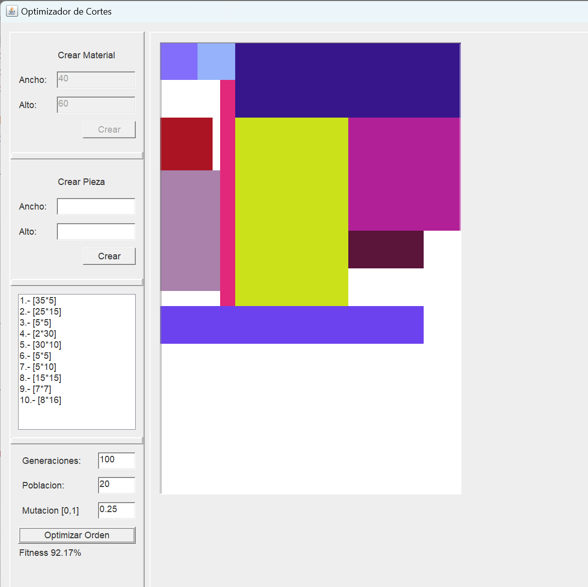
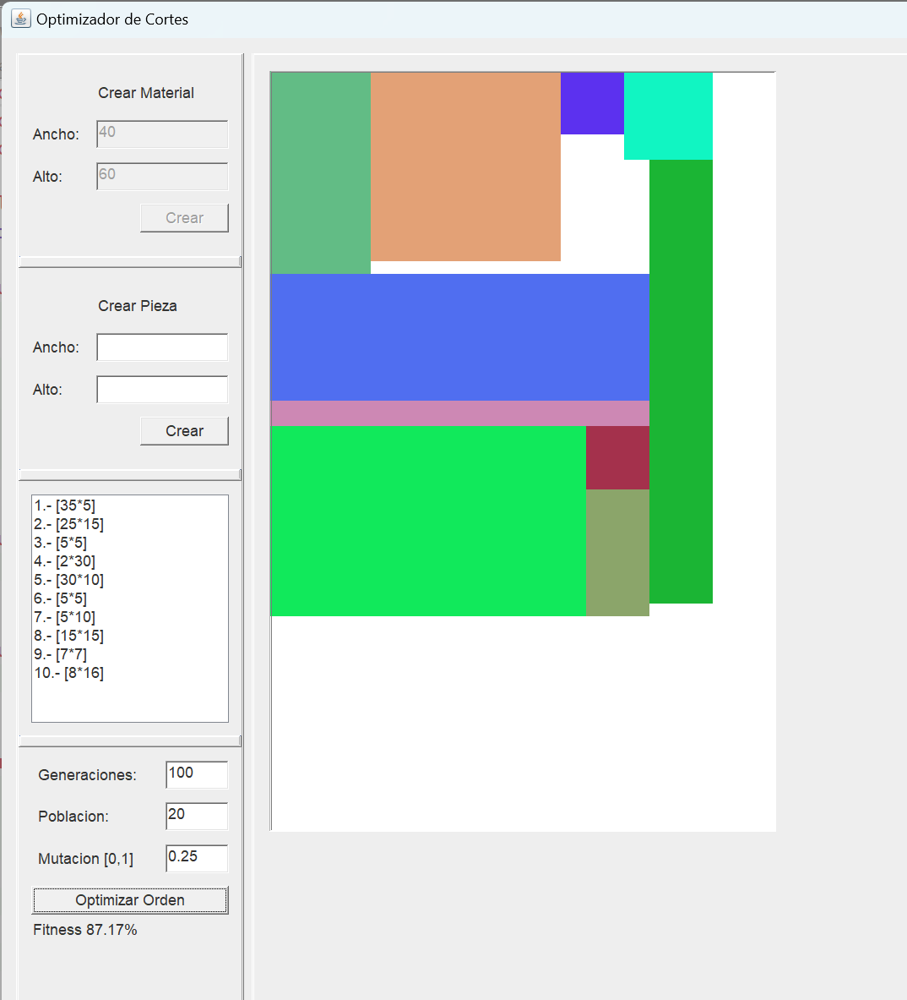

# CuttingStockGUI

This project is an exercise to build a graphical interface in Java for a tool that solves the cutting stock problem by implementing a genetic algorithm.

## Cutting Problem

The Cutting Stock problem consists of finding the most efficient arrangement of pieces on a large sheet of material with known dimensions, aiming to minimize waste and optimally utilize the available material. The pieces can have variable shapes and sizes, and the goal is to determine how to cut and distribute them on the material sheet to meet demand, considering constraints such as piece orientation and the possibility of making guillotine cuts or not. This problem is known to be NP-complete, meaning that there is no known efficient algorithm to find the optimal solution in polynomial time, and its resolution involves applying strategies such as heuristics or evolutionary algorithms to find efficient solutions. It is a common challenge in manufacturing and logistics industries.

The cutting problem addressed here is defined under the following conditions:

- **Dimensions:** In two dimensions.
- **Pieces and Material:** Finite quantity of pieces, which and the material are rectangular in shape.
- **Orientation:** Pieces allow rotation by 90°.
- **Variable Dimensions:** Pieces have variable dimensions.
- **Large Object:** It is a single large object.
- **Non-Guillotineable:** Not guillotineable.

## Objective

The main objective is to arrange the pieces in a layout as compact as possible, minimizing the amount of empty spaces between them.

## Algorithms Used

### Heuristic

A heuristic is a strategy or general rule that, although does not guarantee finding the optimal solution, provides practical and efficient methods to address complex problems. Heuristics are used to reduce the search space and find acceptable solutions more quickly.

The heuristic used is based on the Extreme Points method discussed in the reference Porto.pdf, consisting of storing a list of convenient points where the next piece can be added with some priority. Since it chooses the best option at each instant, I would dare to call it a greedy strategy with strong inspirations from the Bottom-left algorithm.

It is used when making the initial cutting configuration before the genetic algorithm is triggered.

### Genetic Algorithm

In very broad terms, a genetic algorithm consists of a population composed of individuals, which reproduce according to their fitness and pass to the next generation. This process continues until desirable traits persist while unfavorable ones extinguish, progressively until finding an acceptable individual or reaching a certain number of generations.

Initialization:

- An initial population of individuals (chromosomes) is created randomly.

Fitness Evaluation:

- The fitness function assigns a numerical value indicating how compact each individual is in the task.

Selection:

- Individuals from the population are chosen to reproduce and create the next generation. The top 10% are chosen to pass directly to the next generation, for the rest, individuals with higher fitness are more likely to be selected through the roulette wheel selection principle.

Crossover:

- Selected pairs of individuals are crossed to produce offspring. During crossover, parts of the chromosomes are exchanged to create new individuals.

Mutation:

- Some of the generated offspring undergo random changes in their chromosomes to introduce variability into the population. Mutation is crucial to avoid premature convergence and explore new solutions, in this case, it is represented as the rotation of a rectangle from the permutation of the individual.

Replacement:

- The new generation replaces the previous generation. This can be done using a variety of strategies, such as generational replacement or fitness-based replacement.

## Graphical User Interface (GUI)

I have a deep-seated preference for retro interfaces, so that was the style choice on this occasion.

The elements in the GUI are simple and self-explanatory, once you have the context of the problem being posed (Size of the large object, size of the small pieces, and the ability to add them heuristically before filling in the parameters related to the genetic algorithm), note that this is not a UI/UX project but rather an AI one.

The above is an example of blocks that have been added and greedily ordered.

Two configurations that improve fitness (using the visible parameters for the genetic algorithm)

## References

For the development of this project, seven documents were considered as references, which are attached to this repository. These documents include two doctoral theses, one master's thesis, and four undergraduate/engineering theses.

## How to Run the Project

To run the project, simply follow these steps:

1. Download the repository locally.
2. Compile all Java classes (javac \*.java).
3. Run the `App.java` file (java App).