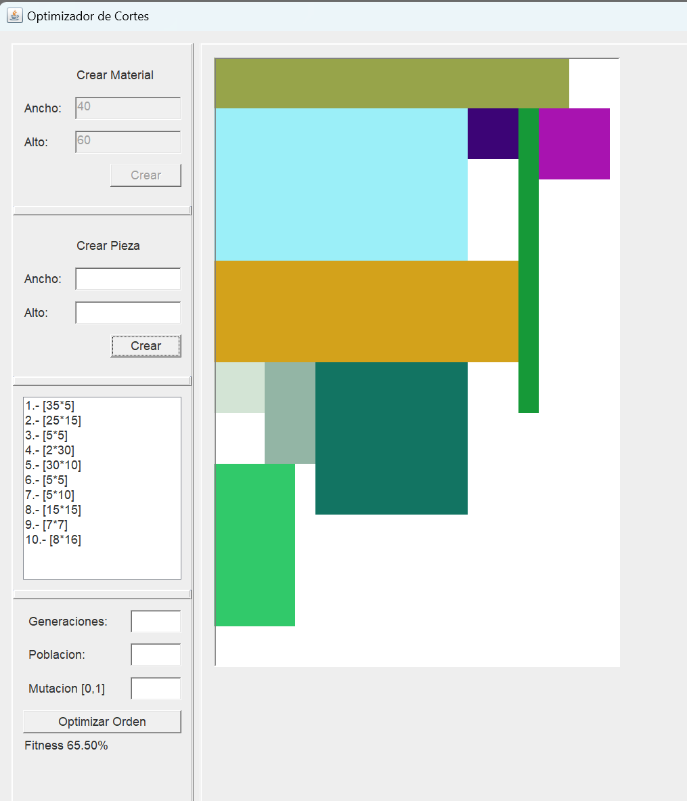
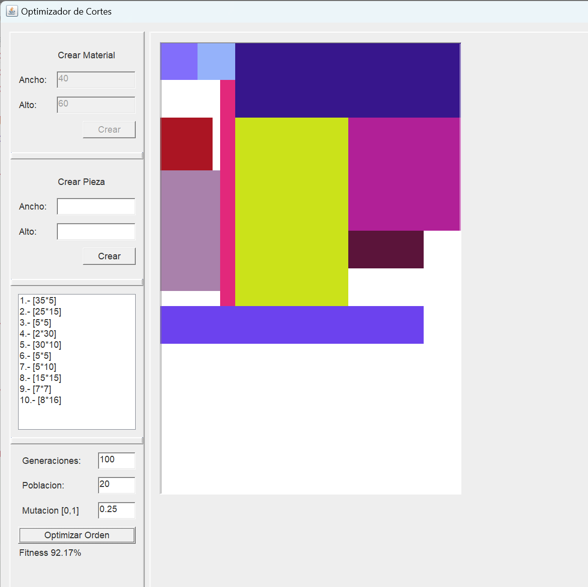
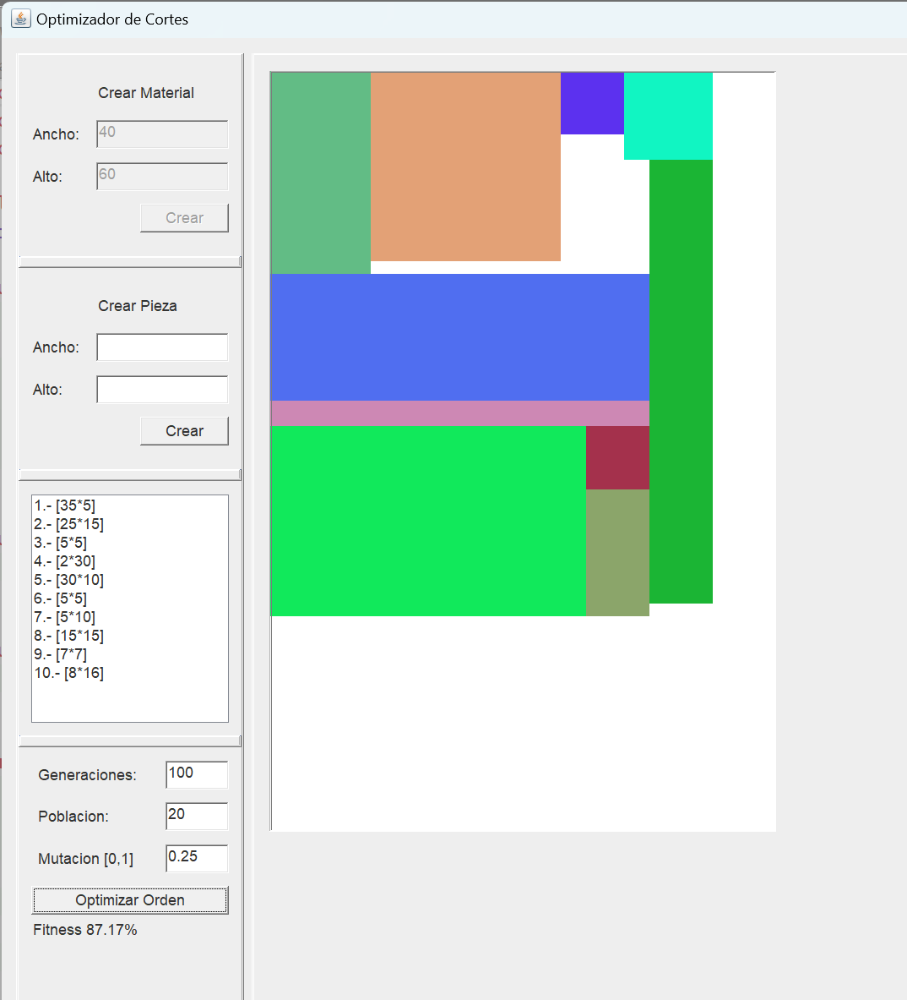

# CuttingStockGUI

Este proyecto es un ejercicio para construir una interfaz gráfica en Java para una herramienta que resuelve el problema de corte de material mediante la implementación de un algoritmo genético.

## Problema de Corte

El problema de Cutting Stock, o problema de corte de material, consiste en encontrar la disposición más eficiente de piezas en una hoja de material grande con dimensiones conocidas, con el objetivo de minimizar el desperdicio y utilizar de manera óptima el material disponible. Las piezas pueden tener formas y tamaños variables, y se busca determinar cómo cortarlas y distribuirlas en la hoja de material para cumplir con la demanda, considerando restricciones como la orientación de las piezas y la posibilidad de realizar o no cortes tipo guillotina. Este problema es conocido por ser NP-completo, lo que significa que no existe un algoritmo eficiente conocido para encontrar la solución óptima en tiempos polinómicos, y su resolución implica la aplicación de estrategias como lo pueden ser por medio de heurísticas o algoritmos evolutivos para encontrar soluciones eficientes. Es un desafío común en la industria manufacturera y logística.

El problema de corte aquí abordado se define bajo las siguientes condiciones:

- **Dimensiones:** En dos dimensiones.
- **Piezas y Material:** Cantidad finita de piezas, las cuales y el material son de forma rectangular.
- **Orientación:** Las piezas permiten rotación en 90°.
- **Dimensiones Variables:** Las piezas tienen dimensiones variables.
- **Objeto Grande:** Se trata de un solo objeto grande.
- **No Guillotinable:** No es guillotinable.

## Objetivo

El objetivo principal es disponer las piezas en un acomodo lo más compacto posible, minimizando la cantidad de espacios vacíos entre ellas.

## Algoritmos Utilizados

### Heurística

Una heurística es una estrategia o regla general que, aunque no garantiza encontrar la solución óptima, proporciona métodos prácticos y eficientes para abordar problemas complejos. Las heurísticas se utilizan para reducir el espacio de búsqueda y encontrar soluciones aceptables de manera más rápida.

La heurística utilizada se basa en el método de Extreme Points que se comenta en la referencia Porto.pdf, consiste en almacenar una lista de puntos convenientes donde pueda ser añadida con alguna prioridad la siguiente pieza, dado que escoge la mejor opción a cada instante me atrevería a llamarla una estrategia voraz con fuertes inspiraciones en el Bottom-left algorithm.

La utilizo al momento de hacer la primer configuración de corte previo al accionar del algoritmo genético.

### Algoritmo Genético

A muy grandes rasgos un algoritmo genético consiste una población que está compuesta de individuos, estos se reproducen según sus aptitudes y pasa a la siguiente generación, así hasta se busca que los rasgos deseables persistan mientras que los desfavorables se extingan, progresivamente hasta encontrar un individuo aceptable o pasar cierta cantidad de generaciones.

Inicialización:

- Se crea una población inicial de individuos (cromosomas) de manera aleatoria.

Evaluación de la Aptitud (Fitness):

- La función de aptitud asigna un valor numérico que indica qué tan compacto cada individuo en la tarea.

Selección:

- Se eligen individuos de la población para reproducirse y crear la próxima generación. Se elige el mejor 10% para que pase directamente a la siguiente generación para el resto, los individuos con mayor aptitud tienen más probabilidades de ser seleccionados por medio del principio de la ruleta.

Crossover (Cruce):

- Pares de individuos seleccionados se cruzan para producir descendencia. Durante el cruce, se intercambian partes de los cromosomas para crear nuevos individuos.

Mutación:

- Algunos de los descendientes generados sufren cambios aleatorios en sus cromosomas para introducir variabilidad en la población. La mutación es crucial para evitar la convergencia prematura y explorar nuevas soluciones, en este caso se representa como la rotación de un rectángulo de la permutación del individuo.

Reemplazo:

- La nueva generación reemplaza a la generación anterior. Esto puede hacerse utilizando una variedad de estrategias, como reemplazo generacional o reemplazo basado en aptitud.

## Interfaz gráfica de usuario (GUI)

Tengo un gusto arraigado por las interfaces retro, así que esa fue la elección de estilo en esta ocasión

Los elementos en la GUI son simples y autoexplicativos, una vez que se tiene el contexto de cuál es el problema que se plantea (Tamaño del objeto grande, tamaño de las piezas pequeñas y capacidad de añadirlas de manera heurística para posteriormente rellenar los campos relativos al algoritmo genético), nótese que este no es un proyecto de UI/UX sino más bien uno de AI.

El anterior es un ejemplo de bloques que han sido añadidos y ordenados vorazmente.

Dos configuraciones que mejoran el fitness (utilizando los parámetros visibles para el algoritmo genético)

## Referencias

Para la elaboración de este proyecto, se consideraron siete documentos como referencia, los cuales se encuentran adjuntos a este repositorio. Estos documentos incluyen dos tesis de doctorado, una tesis de maestría y cuatro tesis de licenciatura/ingeniería.

## Cómo ejecutar el proyecto

Para ejecutar el proyecto, simplemente sigue estos pasos:

1. Descarga localmente el repositorio.
2. Compila todas las clases de Java (javac \*.java).
3. Ejecuta el archivo `App.java` (java App).
